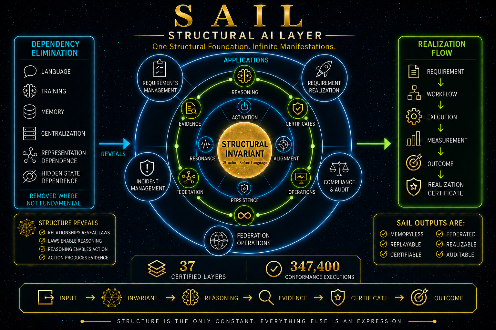

# ⭐ **SAIL**

## **Structural AI Layer**

### **One Structural Foundation. Infinite Manifestations.**


---

**Can intelligence emerge from structure itself?**

SAIL explores whether communication, reasoning, evidence integrity, certification, coordination, federation, operations, monitoring, governance, and realization can emerge through structural interaction rather than through dependence on natural language, large-scale training, centralized models, persistent memory, or traditional chatbot architectures.

Traditional systems often begin with:

`model -> reasoning -> answer`

SAIL explores:

`structure -> invariant -> evidence -> certificate -> outcome`

The complete structural realization chain is:

`Input -> Structure -> Structural Invariant -> Reasoning -> Evidence -> Certificate -> Execution -> Measurement -> Outcome -> Realization Certificate`

The objective is not only to produce an answer.

The objective is to produce a result whose structural basis, evidence classification, lifecycle, and outcome can be independently inspected, challenged, and replayed.

---

# 🔍 **Positioning and Scope**

SAIL is a structural AI and structural computing research platform.

It explores whether intelligent and operational behavior can be produced through:

* visible structures
* explicit relationships
* deterministic invariants
* replayable evidence
* structural certificates
* guarded lifecycle transitions
* measurable outcomes
* realization records

SAIL does **not** claim to replace:

* large language models
* databases
* operating systems
* workflow platforms
* compliance platforms
* requirements platforms
* incident-management systems
* distributed systems
* enterprise applications
* production infrastructure

Instead, SAIL investigates a foundational question:

**Can reasoning, certification, coordination, governance, and realization emerge from visible structure rather than hidden state?**

The reference implementation and applications are designed to be:

* deterministic
* replayable
* inspectable
* certifiable
* auditable
* memoryless
* fail-closed
* structurally explainable

SAIL complements existing systems.

It is a structural layer for certification, traceability, coordination, governance, replay, and realization.

---

# 🧭 **Visual Overview**

The following diagram presents the high-level SAIL architecture and its structural progression from visible input to certified and measurable outcomes.



---

# 🧱 **Standalone Reference Runtime**

SAIL reference runtimes and applications are intentionally standalone.

Anyone can:

* clone the repository
* open a runtime or application in a modern browser
* inspect the implementation
* run the documented validation commands
* compare actual and expected outputs
* replay certificate generation
* attempt falsification
* modify inputs
* add new applications

The browser runtimes do not require:

* a database
* a server
* a network layer
* API keys
* cloud services
* deployment infrastructure
* third-party runtime packages

The absence of mandatory infrastructure dependencies is part of the demonstration.

SAIL's structural invariants are designed to be independently verifiable through visible structure before storage, transport, distributed execution, or production deployment layers are introduced.

Persistent storage adapters, API servers, authentication systems, and distributed federation runtimes may be added without redefining the underlying structural invariants.

The structural layer and infrastructure layer are intentionally separated.

External executable release validation is also supplied. The runtime behavioral test uses Python and Playwright to execute the browser runtime, apply independently specified behavioral oracles, and test controlled source mutations.

The external test dependency does not change the standalone nature of the runtime itself.

---

# ✅ **Validated Platform and Research Program**

The current validated implementation includes:

* deterministic structural certification
* structural and operational identity separation
* replayable evidence
* fail-closed validation
* structural realization verification
* federation verification
* policy and trace certification
* guarded lifecycle transitions
* auditable reference applications
* certified, unresolved, incomplete, blocked, and empty states where applicable
* explicit evidence classification
* independently specified behavioral validation
* controlled source-mutation sensitivity

The v5.9.0 evidence model separates:

* **347,400 synthetic structural conformance executions**
* **96 independently specified behavioral cases**
* **5 controlled source-mutation operators with 5 detections**
* **7 supplemental environment-isolation checks with 0 failures**

The seven environment-isolation checks are external runtime-hardening checks.

They are separate from, and are not included in, the **96 independently specified behavioral specifications**.

`behavioral specification count = 96`

`environment-isolation check count = 7`

The synthetic conformance executions validate deterministic hashing, cloning, replay, component integration, certificate consistency, and structural self-consistency under repetition.

The **347,400** figure represents synthetic execution volume over bounded structural case-template sets. It does not represent 347,400 distinct input structures, unique scenarios, or independent behavioral specifications.

Some conformance-audit families repeatedly cycle through their available structural templates until their configured execution totals are reached.

`synthetic execution count != unique template count`

`synthetic execution count != independent behavioral specification count`

The independently specified behavioral evidence consists of **96 literal behavioral specifications** whose expected outcomes are defined independently from the runtime parser and resolver.

Active research directions include:

* language independence
* memory independence
* training independence
* representation independence
* structure-based coordination
* structure-based intelligence
* structure-based physical action admission

The validated platform and the broader research program should be evaluated independently.

---

# ⚡ **The Core Principle**

Traditional:

`input -> model -> response`

SAIL:

`input -> structure -> invariant -> evidence -> certificate -> outcome`

The objective is not only to generate an answer.

The objective is to produce a **certified structural outcome**.

Core invariant:

`certified result iff visible evidence resolves to a valid certificate`

---

# 🧩 **Core Philosophy**

SAIL is founded on three principles:

`communication = structure`

`meaning = resolved structure`

`capability = structural interaction`

The framework investigates whether shared structures, relationships, constraints, laws, and invariants can support intelligent behavior without requiring language as the foundation of correctness.

Language may describe a structure.

Language does not need to be the structure itself.

---

# 🧠 **Structural Foundations**

SAIL is based on the following structural foundation stack:

`Structural Invariant -> Structural Activation -> Structural Resonance -> Structural Alignment -> Structural Persistence -> Structure`

## **Structural Invariant**

A Structural Invariant is the deepest stable layer remaining after removable dependencies have been eliminated.

It is intended to remain independent of:

* language
* notation
* representation
* persistent memory
* implementation
* viewpoint

---

## **Structural Activation**

Structural Activation represents the emergence of a structural invariant into an active state.

It describes why a structure becomes relevant to a given condition or interaction.

## **Structural Resonance**

Structural Resonance represents propagation, recurrence, reinforcement, and structural transmission.

---

## **Structural Alignment**

Structural Alignment represents convergence toward shared invariants.

It supports:

* certification
* contradiction detection
* structural agreement
* policy consistency
* federation consensus

## **Structural Persistence**

Structural Persistence represents continuity through transformation.

It describes how deeper invariants remain stable while visible structures change.

---

## **Structure**

Structure is the visible manifestation of deeper structural layers.

Structures may:

* emerge
* transform
* align
* compose
* coordinate
* evolve
* dissolve

while remaining connected to deeper invariants.

---

# 🏛️ **Structural Hierarchy**

SAIL organizes structural emergence as:

`Structural Invariant`

↓

`Structural Activation`

↓

`Structural Resonance`

↓

`Structural Alignment`

↓

`Structural Persistence`

↓

`Structure`

↓

`Relationship`

↓

`Behavior`

↓

`Pattern`

↓

`Law`

↓

`Meaning`

↓

`Representation`

↓

`Manifestation`

Relationships emerge from structures.

Behaviors emerge from relationships.

Patterns emerge from behaviors.

Laws emerge from stable patterns.

Meaning emerges from laws and relationships.

Representations emerge from meaning.

Manifestations emerge from representations.

---

# 🧹 **Dependency Elimination**

A central SAIL methodology is dependency elimination.

Instead of continuously adding complexity, SAIL removes dependencies and observes what remains.

Examples include:

* removing language dependence
* removing persistent-memory dependence
* removing centralized control
* removing training dependence
* removing representation-specific assumptions
* removing answer dependence
* removing hidden state

Core chain:

`dependency elimination -> structural alignment -> structural persistence -> structural invariant`

If capability remains after a dependency is removed, that dependency may not be fundamental.

The surviving structure may reveal a deeper foundation.

---

# 🔐 **Memoryless Certification**

SAIL does not use hidden persistent memory as the foundation of certificate correctness.

Instead of:

`Memory -> Future Reasoning`

SAIL uses:

`Visible Input -> Structural Invariant -> Evidence -> Certificate`

The reference runtimes preserve the material required for verification inside visible inputs, structural records, evidence, and certificates.

Every certified result is intended to remain:

* visible
* replayable
* inspectable
* comparable
* falsifiable

---

# 🪪 **Structural and Operational Identity**

SAIL v5.9.0 applications distinguish structural identity from operational identity.

Structural identity represents what a structure **is**.

Operational identity represents a particular runtime record, event, or storage instance.

Core distinction:

`structural identity != operational record identity`

Structural identity invariant:

`same structural payload -> same structural ID`

Operational identity invariant:

`separate runtime record -> separate operational ID`

Operational metadata may include:

* record IDs
* timestamps
* export times
* delivery modes
* interface state

These operational fields are excluded from deterministic structural certificates.

Certificate invariant:

`operational identity and timestamps do not alter structural certificate identity`

This separation supports both:

* deterministic replay
* practical operational traceability

---

# 🧾 **Certified Resolution**

SAIL emphasizes certified resolution.

Core chain:

`Input -> Structural Invariant -> Reasoning -> Evidence -> Certificate -> Certified Result`

SAIL does not merely ask:

**What answer can be produced?**

It asks:

**What result can be certified from visible structure?**

Certification is intended to be:

* deterministic
* evidence-based
* replayable
* inspectable
* falsifiable

---

# 🔁 **Replayability**

SAIL decisions are replayable when all certificate inputs are derived from visible structural fields.

Core invariant:

`same structure -> same evidence -> same certificate`

Replay invariant:

`same certified structure -> same replay result`

Certificate stability is violated when certificate inputs improperly include:

* random identifiers
* timestamps
* hidden mutable state
* external state absent from the structural record

The v5.9.0 reference applications therefore separate structural certificate inputs from operational metadata.

Replay validation supports:

* auditability
* reproducibility
* deterministic verification
* certificate comparison
* lifecycle reconstruction
* structural consistency

---

# 🛑 **Fail-Closed Validation**

SAIL reference workflows use explicit guards.

A downstream state is not certified merely because a button was clicked or a function was called.

A transition is admitted only when its structural preconditions are satisfied.

General guard principle:

`downstream certification allowed iff all required upstream structures are certified`

Blocked states remain visible.

Examples include:

* recovery blocked before required escalation
* verification blocked before recovery
* realization blocked before approval
* approval blocked before trace certification
* federation replay blocked before network resolution
* federation audit blocked before replay

---

# 🧩 **Structural Coordination**

Certified structures can coordinate through shared invariants.

Core chain:

`Structure A + Structure B + Structure N -> Coordination Invariant -> Coordinated State`

Coordination allows multiple structures to resolve a shared state through visible relationships and constraints.

---

# 🌐 **Structural Federation**

SAIL supports decentralized structural federation.

Correct federation flow:

`Node Identity -> Peer Exchange -> Quorum -> Consensus -> Federated Replay -> Federated Audit`

Quorum is a property of network configuration.

It is not part of individual node identity.

Quorum invariant:

`quorum certified iff certified node count >= configured quorum`

Consensus requires sufficient certified participation and structural agreement.

Consensus invariant:

`consensus certified iff quorum met AND network identity aligned AND scope aligned`

Federation certification requires explicit network resolution.

Federation invariant:

`federation certified iff network resolved AND quorum certified AND consensus certified`

Replay requires certified federation.

Audit requires certified replay.

`federated replay allowed iff federation certified`

`federated audit allowed iff federation certified AND replay certified`

---

# ⚙️ **Structural Operations**

SAIL supports operational workflows.

Core chain:

`Request -> Workflow -> Execution -> Monitoring -> Incident Detection -> Escalation -> Recovery -> Operations Certificate`

Operations transform certified structure into executable and measurable structure.

---

# 📡 **Structural Monitoring and Recovery**

SAIL supports structural monitoring and recovery.

Core chain:

`Health State -> Drift Detection -> Degradation Detection -> Incident Identification -> Recovery Plan -> Recovery Execution -> Verification Certificate`

Monitoring enables structural awareness, guarded recovery, and outcome verification.

---

# ✅ **Structural Realization**

SAIL connects certified workflows with measurable outcomes.

Core chain:

`Requirement -> Workflow -> Execution -> Measurement -> Outcome Verification -> Realization Certificate`

The objective is not only to certify reasoning.

The objective is to certify a structurally represented realized result.

Realization principle:

`realization certified iff required execution, measurement, and verification structures are complete`

---

# 📊 **Current Validated Status**

Current platform:

**SAIL v5.9.0 Evidence Integrity Runtime**

Certified structural layers:

**37**

Synthetic structural conformance executions:

**347,400**

Conformance classification:

`SYNTHETIC_STRUCTURAL_CONFORMANCE_EXECUTIONS`

Independently specified behavioral cases:

**96**

Behavioral oracle origin:

`EXTERNALLY_SPECIFIED_LITERAL_EXPECTATIONS`

Behavioral failures:

**0**

Controlled source-mutation operators:

**5**

Controlled source mutations detected:

**5**

Supplemental environment-isolation checks:

**7**

Environment-isolation failures:

**0**

Validated realization-audit cases:

**48,600**

Validated legacy structural-federation audit cases: 

**450**

Validated federation-network audit checks: 

**43,200** 

Federation audit APIs: 

`SAIL.federationAudit().case_count = 450` 

`SAIL.federationNetworkAudit().case_count = 43200`

Validated reference applications:

**5**

Current reference-application version:

**1.1.2**

Locally executed application-conformance cases:

**55,000**

Application-conformance total:

`10,000 + 12,000 + 12,000 + 12,000 + 9,000 = 55,000`

Current platform chain:

`Input -> Structure -> Structural Invariant -> Reasoning -> Evidence -> Certificate -> Execution -> Measurement -> Outcome -> Realization Certificate`

---

# 🧪 **Validation Source Distinction**

SAIL v5.9.0 distinguishes four primary validation categories and one supplemental runtime-hardening validation set.

## **Synthetic Structural Conformance**

Classification:

`SYNTHETIC_STRUCTURAL_CONFORMANCE_EXECUTIONS`

Execution count:

**347,400**

These executions validate deterministic hashing, cloning, replay, component integration, certificate consistency, and structural self-consistency under repetition.

The execution count measures the total number of synthetic audit executions. It is not a count of distinct input structures or unique behavioral scenarios.

The conformance system uses bounded sets of structural case templates across multiple audit families. Where an audit family requires a larger execution total, its available templates are cycled repeatedly to test deterministic stability, replay consistency, and repeated structural equivalence.

Accordingly:

`347400 = synthetic conformance execution volume`

`347400 != unique structural template count`

`347400 != independent behavioral specification count`

The independently specified behavioral suite contains **96 cases**.


## **Independent Behavioral Validation**

Behavioral specification count:

**96**

Oracle origin:

`EXTERNALLY_SPECIFIED_LITERAL_EXPECTATIONS`

The specifications include positive, negative, boundary, malformed-input, tamper, permission, quorum, realization, and metamorphic cases.

## **Controlled Mutation Sensitivity**

Source-mutation operators:

**5**

Required detections:

**5**

This validates sensitivity to the supplied controlled mutation operators. It does not claim exhaustive defect detection.

---

## **Supplemental Environment-Isolation Validation**

Environment-isolation checks:

**7**

Environment-isolation failures:

**0**

These external runtime checks verify that expressions cannot depend on browser-global state, undeclared identifiers, object-property traversal, constructor access, or nondeterministic environment functions.

Required behavior:

`environment-dependent expression -> ABSTAIN`

`undeclared identifier -> ABSTAIN`

`property or constructor access -> ABSTAIN`

`same rejected expression + changed browser environment -> same rejection state + same certificate`

These checks are supplemental and are not included in the **96 independently specified behavioral specifications**.

---

## **Application Conformance**

Application audit classification:

`LOCAL_APPLICATION_CONFORMANCE_EXECUTIONS`

Application audit execution:

`LOCAL_RUNTIME`

Applications locally execute their own application-conformance audits.

Core evidence values exposed by applications are referenced from the validated release and identified as:

`REFERENCE_RELEASE_VALIDATION`

This distinction prevents an application from overstating its local validation. Applications do not independently rerun the complete core suites. 

These include: 

* structural conformance 
* behavioral validation 
* mutation validation 
* realization audit 
* legacy structural-federation audit 
* federation-network audit

Example:

```javascript
{
  application_audit_classification:
    "LOCAL_APPLICATION_CONFORMANCE_EXECUTIONS",
  application_audit_execution:
    "LOCAL_RUNTIME",
  conformance_execution:
    "REFERENCE_RELEASE_VALIDATION",
  behavioral_validation_execution:
    "REFERENCE_RELEASE_VALIDATION",
  mutation_validation_execution:
    "REFERENCE_RELEASE_VALIDATION"
}
```

The backward-compatible `SAIL.benchmark()` interface continues to report **347,400**, but the runtime classifies those executions accurately as synthetic structural conformance executions.

## **Evidence Integrity APIs**

The v5.9.0 runtime exposes:

* `SAIL.conformanceAudit()`
* `SAIL.behaviorAudit()`
* `SAIL.behaviorSpecifications()`
* `SAIL.evidenceValidation()`
* `SAIL.evidenceProfile()`
* `SAIL.resetEvidenceAuditCache()`

These APIs make evidence class, behavioral-oracle origin, counts, failures, and validation status directly inspectable.

---

# 🧱 **Validated Structural Layers**

SAIL currently validates the following 37 structural layers:

1. Structural Alignment
2. Structural Federation
3. Structural Governance
4. Structural Institution
5. Structural Ecosystem
6. Structural Continuity
7. Structural Composition
8. Structural Self-Repair
9. Structural Evolution
10. Structural Realization
11. Structural Ledger
12. Structural Traceability
13. Structural Observability
14. Structural Integrity
15. Structural Runtime
16. Structural APIs
17. Structural CI
18. Structural Deployment
19. Structural Expression Completeness
20. Structural Formula Completeness
21. Structural Scientific Function Resolution
22. Structural Law Completeness
23. Structural Coordination
24. Structural Autonomy
25. Structural Policy Runtime
26. Structural Security
27. Structural Persistence
28. Structural Application Runtime
29. Structural Storage Runtime
30. Structural Server Runtime
31. Structural Explorer Runtime
32. Structural Identity and Permission Runtime
33. Structural Test Harness Runtime
34. Structural Operations Runtime
35. Structural Monitoring and Recovery Runtime
36. Structural Federation Network Runtime
37. Structural Realization Runtime

---

# 🧮 **Expression, Formula, and Law Resolution**

SAIL supports structural resolution of expressions, formulas, and laws.

## **Expressions**

Examples:

`sin(pi/2)`

`cos(0)`

`tan(pi/4)`

`log(100)`

`ln(e)`

`sqrt(81)`

## **Formulas**

Examples:

`F = m*a`

`P = V*I`

`E = m*c^2`

## **Laws**

Example:

`entropy = log(variance + 1) * exp(-lambda*t)`

The objective is certified structural resolution rather than numerical evaluation alone.

---

# 🖥️ **Repository Structure**

Recommended repository structure:

```text
core/
applications/
docs/
VERIFY/
LICENSE
README.md
```

The repository is intentionally simple.

## **core/**

Contains the certified SAIL platform and evidence-validation artifacts.

Expected contents:

* `SAIL_v5_9_0_Evidence_Integrity_Runtime.html`
* `README.md`
* `SAIL_v5_9_0_console_tests.txt`
* `SAIL_v5_9_0_behavioral_oracles.json`
* `sail_v5_9_0_runtime_behavior_test.py`
* `sail_v5_9_0_source_integrity_test.py`
* `SHA256SUMS.txt`

## **applications/**

Contains the five reference applications.

Recommended folders:

* `SAIL_Requirement_Realization_Console_v_1_1_2/`
* `SAIL_Requirements_Management_System_v1_1_2/`
* `SAIL_Incident_Management_System_v1_1_2/`
* `SAIL_Compliance_Audit_Console_v1_1_2/`
* `SAIL_Federation_Operations_Console_v1_1_2/`

Each application folder contains:

* standalone HTML application
* application README
* browser console-verification document
* Python structural-verification script

## **docs/**

Contains:

* public documentation
* architecture notes
* terminology
* concept explanations
* application descriptions
* research boundaries

## **VERIFY/**

Contains:

* `VERIFY.txt`
* `CORE_VERIFY.txt`
* `APPLICATION_VERIFY.txt`
* `RELEASE_VERIFY.txt`

# 🚀 **Reference Applications**

SAIL includes five validated reference applications built on the complete 37-layer stack and synchronized with **SAIL v5.9.0**.

---

## **Application 1: Requirement Realization Console**

### **Purpose**

Certify a requirement, bind it to a workflow, execute the workflow, measure the result, verify the outcome, and issue a realization certificate.

Application chain:

`Requirement -> Workflow -> Execution -> Measurement -> Outcome Verification -> Realization Certificate`

### **v1.1.2 Structural Capabilities**

* requirement certification independent of workflow structure
* deterministic requirement certificates
* workflow identity separated from requirement identity
* execution and measurement guards
* independent boolean and score-threshold outcome states
* zero measurement threshold accepted
* negative measurement threshold rejected
* deterministic realization certificates
* deterministic outcome-ledger certificates
* blocked realization example
* view and download realization-pack consistency
* cached local application audit
* explicit local-versus-reference evidence metadata

### **Validated Status**

* Application Version: **1.1.2**
* SAIL Stack: **5.9.0**
* Application Audit: **PASS**
* Local Application-Conformance Cases: **10,000**
* Audit Scenarios: **5**
* Iterations Per Scenario: **2,000**
* Certified Layers: **37**
* Referenced Structural Conformance Executions: **347,400**
* Referenced Behavioral Specifications: **96**
* Referenced Source Mutations Detected: **5 of 5**

Console validation:

```javascript
[
  SAIL_APP.version(),
  SAIL_APP.stackVersion(),
  SAIL_APP.audit().allPass,
  SAIL_APP.audit().case_count,
  SAIL.certify().layers,
  SAIL.benchmark().benchmark_case_count
]
```

Expected:

```javascript
[
  "1.1.2",
  "5.9.0",
  true,
  10000,
  37,
  347400
]
```

---

## **Application 2: Requirements Management System**

### **Purpose**

Capture, structurally decompose, certify, govern, trace, approve, and realize requirements.

Application chain:

`Requirement -> Policy -> Trace -> Approval -> Realization`

### **v1.1.2 Structural Capabilities**

* deterministic requirement identity
* separate operational record identity
* actor-action-object decomposition
* explicit policy binding
* missing-policy guards
* measurement-based trace certification
* input-driven approval API
* input-driven realization API
* idempotent approval
* idempotent realization
* policy-change lifecycle reset
* requirement-structure lifecycle reset
* dynamic trace stages
* deterministic trace-chain certificate
* missing-field register visibility
* structural and operational pack separation
* certified, unresolved, incomplete, and empty pack states

Structural grammar:

`requirement capability = actor + action + object`

Policy invariant:

`policy bound iff requirement certified AND policy present`

Trace invariant:

`trace certified iff requirement certified AND policy bound AND measurement present`

Realization invariant:

`realization allowed iff requirement certified AND policy bound AND trace certified AND approval certified`

### **Validated Status**

* Application Version: **1.1.2**
* SAIL Stack: **5.9.0**
* Application Audit: **PASS**
* Local Application-Conformance Cases: **12,000**
* Audit Scenarios: **8**
* Iterations Per Scenario: **1,500**
* Certified Layers: **37**
* Referenced Structural Conformance Executions: **347,400**
* Referenced Behavioral Specifications: **96**
* Referenced Source Mutations Detected: **5 of 5**
* Referenced Realization-Audit Cases: **48,600**

Console validation:

```javascript
[
  SAIL_REQ.version(),
  SAIL_REQ.stackVersion(),
  SAIL_REQ.audit().allPass,
  SAIL_REQ.audit().case_count,
  SAIL.certify().layers,
  SAIL.benchmark().benchmark_case_count
]
```

Expected:

```javascript
[
  "1.1.2",
  "5.9.0",
  true,
  12000,
  37,
  347400
]
```

---

## **Application 3: Incident Management System**

### **Purpose**

Detect, certify, triage, escalate when structurally required, recover, verify, and resolve incidents through deterministic lifecycle certificates.

Application chain:

`Detection -> Triage -> Escalation When Required -> Recovery -> Verification -> Realization Certificate`

### **v1.1.2 Structural Capabilities**

* deterministic incident identity
* separate operational record identity
* severity-and-condition risk scoring
* explicit escalation reasons
* critical-severity independent escalation
* recovery guard
* verification guard
* optional-escalation recovery path
* required-escalation recovery path
* idempotent escalation
* idempotent recovery
* idempotent verification
* lifecycle reset after structural changes
* deterministic lifecycle certificate chain
* Verified status counter
* structural and operational pack separation
* certified, unresolved, incomplete, and empty pack states

Risk formula:

`risk score = severity weight + condition weight`

Escalation invariant:

`escalation required iff triage = HIGH OR triage = CRITICAL OR severity = CRITICAL`

Recovery invariant:

`recovery allowed iff incident certified AND (escalation not required OR escalation certified)`

Resolution invariant:

`incident resolved iff recovery certified AND verification certified`

Escalation is conditional rather than universal.

It is required only when the risk or severity structure activates the escalation condition.

### **Validated Status**

* Application Version: **1.1.2**
* SAIL Stack: **5.9.0**
* Application Audit: **PASS**
* Local Application-Conformance Cases: **12,000**
* Audit Scenarios: **8**
* Iterations Per Scenario: **1,500**
* Certified Layers: **37**
* Referenced Structural Conformance Executions: **347,400**
* Referenced Behavioral Specifications: **96**
* Referenced Source Mutations Detected: **5 of 5**
* Referenced Realization-Audit Cases: **48,600**

Console validation:

```javascript
[
  SAIL_INC.version(),
  SAIL_INC.stackVersion(),
  SAIL_INC.audit().allPass,
  SAIL_INC.audit().case_count,
  SAIL.certify().layers,
  SAIL.benchmark().benchmark_case_count
]
```

Expected:

```javascript
[
  "1.1.2",
  "5.9.0",
  true,
  12000,
  37,
  347400
]
```

---

## **Application 4: Compliance and Audit Console**

### **Purpose**

Certify controls, bind policy, evaluate evidence, handle exceptions, and produce deterministic audit receipts.

Application chain:

`Policy -> Evidence -> Control -> Exception -> Audit Receipt`

### **v1.1.2 Structural Capabilities**

* deterministic structural control identity
* separate operational identity
* explicit PASS, FAIL, and EXCEPTION semantics
* policy binding
* evidence certification
* exception guards
* deterministic audit receipts
* certificate consistency
* replay consistency
* certified and unresolved export states
* structural and operational export separation
* cached local application audit
* local-versus-reference validation distinction

Compliance invariant:

`control compliant iff evaluation certified AND result = PASS`

### **Validated Status**

* Application Version: **1.1.2**
* SAIL Stack: **5.9.0**
* Application Audit: **PASS**
* Local Application-Conformance Cases: **12,000**
* Audit Scenarios: **8**
* Iterations Per Scenario: **1,500**
* Certified Layers: **37**
* Referenced Structural Conformance Executions: **347,400**
* Referenced Behavioral Specifications: **96**
* Referenced Source Mutations Detected: **5 of 5**

Console validation:

```javascript
[
  SAIL_AUD.version(),
  SAIL_AUD.stackVersion(),
  SAIL_AUD.audit().allPass,
  SAIL_AUD.audit().case_count,
  SAIL.certify().layers,
  SAIL.benchmark().benchmark_case_count
]
```

Expected:

```javascript
[
  "1.1.2",
  "5.9.0",
  true,
  12000,
  37,
  347400
]
```

---

## **Application 5: Federation Operations Console**

### **Purpose**

Configure a federation network, register certified nodes, verify quorum and consensus, replay network state, and issue deterministic federation audit artifacts.

Correct application chain:

`Node Identity -> Peer Exchange -> Quorum -> Consensus -> Federated Replay -> Federated Audit`

### **v1.1.2 Structural Capabilities**

* independent network configuration
* network-level quorum
* quorum excluded from node identity
* deterministic network-configuration certificate
* deterministic node certificates
* network identity alignment
* scope alignment
* pending-node exclusion
* observer-role participation
* explicit network-resolution guard
* replay guard
* audit guard
* consensus-failure example
* deterministic network, replay, and audit certificates
* certified and unresolved federation packs
* cached local application audit
* referenced core federation-network audit metadata

Node invariant:

`same node structure -> same node certificate`

Quorum invariant:

`quorum certified iff certified node count >= configured quorum`

Consensus invariant:

`consensus certified iff quorum met AND network identity aligned AND scope aligned`

Federation invariant:

`federation certified iff network resolved AND quorum certified AND consensus certified`

Replay invariant:

`same federation structure -> same certificate chain -> same federated outcome`

### **Validated Status**

* Application Version: **1.1.2**
* SAIL Stack: **5.9.0**
* Application Audit: **PASS**
* Local Application-Conformance Cases: **9,000**
* Audit Scenarios: **6**
* Iterations Per Scenario: **1,500**
* Certified Layers: **37**
* Referenced Structural Conformance Executions: **347,400**
* Referenced Behavioral Specifications: **96**
* Referenced Source Mutations Detected: **5 of 5**
* Referenced Federation-Network Audit Checks: **43,200** 
* Referenced Core API: `SAIL.federationNetworkAudit()`

Console validation:

```javascript
[
  SAIL_FED.version(),
  SAIL_FED.stackVersion(),
  SAIL_FED.audit().allPass,
  SAIL_FED.audit().case_count,
  SAIL.certify().layers,
  SAIL.benchmark().benchmark_case_count
]
```

Expected:

```javascript
[
  "1.1.2",
  "5.9.0",
  true,
  9000,
  37,
  347400
]
```

# 🛡️ **Reference Application Safety Invariants**

## **Requirement Realization**

`realization certified iff requirement, workflow, execution, measurement, and outcome-verification guards pass`

## **Requirements Management**

`policy bound iff requirement certified AND policy present`

`trace certified iff requirement certified AND policy bound AND measurement present`

`realization allowed iff requirement certified AND policy bound AND trace certified AND approval certified`

## **Incident Management**

`escalation required iff triage = HIGH OR triage = CRITICAL OR severity = CRITICAL`

`recovery allowed iff incident certified AND (escalation not required OR escalation certified)`

`incident resolved iff recovery certified AND verification certified`

## **Compliance and Audit**

`control compliant iff evaluation certified AND result = PASS`

## **Federation Operations**

`quorum certified iff certified node count >= configured quorum`

`consensus certified iff quorum met AND network identity aligned AND scope aligned`

`federation certified iff network resolved AND quorum certified AND consensus certified`

---

# ⚡ **90-Second Structural Proof**

Open the core runtime:

`core/SAIL_v5_9_0_Evidence_Integrity_Runtime.html`

Run in the browser console:

```javascript
[
  SAIL.version(),
  SAIL.conformanceAudit().allPass,
  SAIL.conformanceAudit().conformance_execution_count,
  SAIL.behaviorAudit().allPass,
  SAIL.behaviorAudit().specification_count,
  SAIL.behaviorAudit().failed_count,
  SAIL.evidenceValidation().allPass,
  SAIL.certify().layers
]
```

Expected:

```javascript
[
  "5.9.0",
  true,
  347400,
  true,
  96,
  0,
  true,
  37
]
```

This validates:

* SAIL version
* synthetic structural conformance status
* conformance execution count
* independently specified behavioral-audit status
* behavioral specification count
* behavioral failure count
* evidence-validation status
* certified structural layer count

For external executable validation, run:

```text
python core/sail_v5_9_0_runtime_behavior_test.py
python core/sail_v5_9_0_source_integrity_test.py
```

# ⚡ **Ready-to-Use Design**

The absence of mandatory storage, network, or server dependencies is a deliberate architectural choice.

The reference implementation is designed to run immediately after cloning.

No installation is required beyond a modern browser.

Typical workflow:

`clone -> open runtime -> run validation -> inspect certificates -> attempt falsification -> extend`

Most demonstrations operate through standalone HTML runtimes and browser-console validation commands documented in the application README files.

This allows researchers, developers, auditors, and reviewers to evaluate and challenge the platform without first deploying infrastructure.

---

# 🚀 **Quick Start**

## **Run the Core Runtime**

Open:

`core/SAIL_v5_9_0_Evidence_Integrity_Runtime.html`

Run:

```javascript
[
  SAIL.version(),
  SAIL.conformanceAudit().allPass,
  SAIL.conformanceAudit().conformance_execution_count,
  SAIL.behaviorAudit().allPass,
  SAIL.behaviorAudit().specification_count,
  SAIL.evidenceValidation().allPass,
  SAIL.certify().layers
]
```

Expected:

```javascript
[
  "5.9.0",
  true,
  347400,
  true,
  96,
  true,
  37
]
```

Inspect the evidence profile:

```javascript
SAIL.evidenceProfile()
```

The profile must distinguish synthetic structural conformance from independently specified behavioral evidence.

## **Run External Core Validation**

Install the runtime test dependency:

```text
python -m pip install playwright
python -m playwright install chromium
```

Run:

```text
python core/sail_v5_9_0_runtime_behavior_test.py
python core/sail_v5_9_0_source_integrity_test.py
```

## **Run a Reference Application**

Open an application HTML file inside:

`applications/`

Example:

`applications/SAIL_Requirement_Realization_Console_v_1_1_2/SAIL_Requirement_Realization_Console_v1_1_2.html`

Run:

```javascript
[
  SAIL_APP.version(),
  SAIL_APP.stackVersion(),
  SAIL_APP.audit().allPass,
  SAIL_APP.audit().case_count,
  SAIL.certify().layers,
  SAIL.benchmark().benchmark_case_count
]
```

Expected:

```javascript
[
  "1.1.2",
  "5.9.0",
  true,
  10000,
  37,
  347400
]
```

Each application includes its own browser console-verification document and Python structural-verification script with additional success, blocked, incomplete, replay, idempotency, reset, and export tests.

---

# 🌐 **Interactive Runtime**

SAIL includes offline interactive HTML runtimes.

The core runtime demonstrates:

* structural reasoning
* evidence generation
* evidence integrity validation
* certification
* persistence
* storage
* server runtime
* explorer runtime
* identity and permission runtime
* test harness runtime
* operations runtime
* monitoring and recovery runtime
* federation network runtime
* realization runtime
* synthetic structural conformance reporting
* independent behavioral specification auditing

The applications demonstrate:

* requirement realization
* requirements governance
* incident management
* compliance and audit
* federation operations

Modern browsers may display a warning when a standalone file attempts to access another `file://` resource.

Example warning:

`file: URLs are treated as unique security origins`

This warning concerns browser same-origin restrictions.

It does not invalidate console results that execute successfully inside the loaded runtime.

When local-file restrictions affect a browser feature, start a local server:

```text
python -m http.server 8000
```

Then open:

`http://localhost:8000/`

# 🔐 **Deterministic Invariants**

`same structure -> same structural identity`

`same structure -> same evidence`

`same structure -> same certificate`

`same structure -> same replay result`

`same structure -> same realization state`

`same visible input -> same certified outcome`

`separate runtime record -> separate operational identity`

`operational metadata excluded -> structural certificate remains stable`

Determinism applies when certificate inputs are derived exclusively from visible structural fields.

Random identifiers, timestamps, interface state, and external hidden state are excluded from structural certificate generation.

---

# 🧾 **Structural Vocabulary**

| Term                               | Meaning                                                                  |
| ---------------------------------- | ------------------------------------------------------------------------ |
| `Structural Invariant`             | Stable layer remaining after dependency elimination                      |
| `Structural Activation`            | Emergence of an invariant into an active state                           |
| `Structural Resonance`             | Propagation and reinforcement of structure                               |
| `Structural Alignment`             | Convergence toward a shared invariant                                    |
| `Structural Persistence`           | Continuity through transformation                                        |
| `Structural Identity`              | Deterministic identity derived from structural content                   |
| `Operational Identity`             | Identity of a runtime record or operational instance                     |
| `Evidence Integrity`               | Accurate classification and validation of supplied evidence              |
| `Synthetic Structural Conformance` | Repeated structural executions validating deterministic self-consistency |
| `Behavioral Specification`         | Independently specified expected behavior for a visible input            |
| `Mutation Sensitivity`             | Detection of controlled source changes by external validation            |
| `Certificate`                      | Deterministic structural decision identity                               |
| `Replay`                           | Reproduction of a certified outcome                                      |
| `Guard`                            | Structural precondition controlling a lifecycle transition               |
| `Policy Binding`                   | Certified relationship between structure and policy                      |
| `Trace`                            | Certified relationship between structure and evidence                    |
| `Federation`                       | Decentralized certified coordination                                     |
| `Quorum`                           | Minimum certified-node participation requirement                         |
| `Consensus`                        | Certified agreement on network identity and scope                        |
| `Realization`                      | Certified outcome after execution and measurement                        |
| `Outcome`                          | Measured result of a certified workflow                                  |

---

# 🧭 **Architecture**

SAIL architecture can be summarized as:

`Input`

↓

`Structural Invariant`

↓

`Reasoning`

↓

`Evidence`

↓

`Certificate`

↓

`Execution`

↓

`Measurement`

↓

`Outcome`

↓

`Realization Certificate`

The focus is not answer generation alone.

The focus is structural certification and realized outcomes.

---

# ⚠️ **Scope and Boundaries**

SAIL does **not** claim:

* universal intelligence
* replacement of all AI systems
* replacement of all software platforms
* replacement of production infrastructure
* replacement of database systems
* replacement of security systems
* universal correctness for every domain
* external authentication of supplied evidence
* regulatory or legal certification
* third-party certification
* safety-critical production readiness
* exhaustive mutation coverage
* that synthetic structural conformance executions are independent behavioral specifications

SAIL demonstrates:

* structural reasoning
* structural certification
* deterministic identity
* replayable outcomes
* memoryless verification
* guarded workflows
* structural operations
* structural monitoring
* structural federation
* structural realization
* working reference applications
* accurate evidence classification
* independently specified behavioral cases
* controlled mutation sensitivity

Application certificates validate supplied visible structures and implemented reference invariants.

They do not independently prove that external real-world events, identities, policies, measurements, recoveries, or outcomes are authentic.

SAIL certification denotes internal structural conformance and behavioral validation within the supplied reference implementation.

It is not regulatory, safety, security, compliance, governmental, institutional, or standards certification.

---

# 📂 **Documentation**

Recommended documentation files:

* [Quickstart](docs/Quickstart.md)
* [FAQ](docs/FAQ.md)
* [Architecture Notes](docs/SAIL-Architecture-Notes.md)
* [Resolution Guarantees](docs/SAIL-Resolution-Guarantees.md)
* [SAIL Challenge](docs/SAIL-Challenge.md)

Visual architecture and ecosystem references:

* [SAIL Architecture Diagram](docs/SAIL-Diagram.png)
* [Dependency Elimination Framework](docs/Dependency-Elimination-Framework.png)
* [Shunyaya Structural Stack](docs/Shunyaya-Structural-Stack.png)

The **SAIL Architecture Diagram** represents the architecture directly demonstrated by the SAIL reference implementation.

The **Dependency Elimination Framework** and **Shunyaya Structural Stack** provide broader research and ecosystem context.

They should not be interpreted as additional SAIL v5.9.0 conformance, behavioral, mutation, realization, federation, or certification claims.

---

# 🧠 **Core Runtime**

The SAIL core release is the **SAIL v5.9.0 Evidence Integrity Runtime**.

It provides the complete **37-layer structural foundation** used by the five reference applications.

Core release directory:

`core/`

Core artifacts:

* [`SAIL_v5_9_0_Evidence_Integrity_Runtime.html`](core/SAIL_v5_9_0_Evidence_Integrity_Runtime.html)
* [`README.md`](core/README.md)
* [`SAIL_v5_9_0_console_tests.txt`](core/SAIL_v5_9_0_console_tests.txt)
* [`SAIL_v5_9_0_behavioral_oracles.json`](core/SAIL_v5_9_0_behavioral_oracles.json)
* [`sail_v5_9_0_runtime_behavior_test.py`](core/sail_v5_9_0_runtime_behavior_test.py)
* [`sail_v5_9_0_source_integrity_test.py`](core/sail_v5_9_0_source_integrity_test.py)
* [`SHA256SUMS.txt`](core/SHA256SUMS.txt)

## **Core Validation Profile**

* Runtime Version: **5.9.0**
* Runtime: **Evidence Integrity Runtime**
* Certified Structural Layers: **37**
* Synthetic Structural Conformance Executions: **347,400**
* Independent Behavioral Specifications: **96**
* Behavioral Failures: **0**
* Controlled Source-Mutation Operators: **5**
* Controlled Source Mutations Detected: **5**
* Supplemental Environment-Isolation Checks: **7**
* Environment-Isolation Failures: **0**
* Realization-Audit Cases: **48,600** 
* Legacy Structural-Federation Audit Cases: **450** 
* Federation-Network Audit Checks: **43,200**

Conformance classification:

`SYNTHETIC_STRUCTURAL_CONFORMANCE_EXECUTIONS`

The reported conformance count measures repeated synthetic execution volume over bounded structural case-template sets. 
It does not represent 347,400 unique inputs or independent behavioral specifications.

Behavioral oracle origin:

`EXTERNALLY_SPECIFIED_LITERAL_EXPECTATIONS`

Core evidence principle:

`synthetic structural conformance != independently specified behavioral validation`

---

## **Core Runtime Responsibilities**

The core runtime provides:

* structural reasoning
* evidence generation
* deterministic certificate generation
* replay validation
* structural conformance validation
* independent behavioral specification auditing
* evidence-integrity reporting
* policy and governance runtime
* operations and monitoring runtime
* federation runtime
* realization runtime
* backward-compatible benchmark and audit interfaces

---

## **Core Verification**

Browser-console verification is provided through:

`SAIL_v5_9_0_console_tests.txt`

Executable behavioral verification is provided through:

`sail_v5_9_0_runtime_behavior_test.py`

Source and package-integrity verification is provided through:

`sail_v5_9_0_source_integrity_test.py`

Release-file integrity is recorded in:

`SHA256SUMS.txt`

Both runtime behavioral verification and source-integrity verification are required for complete core-release validation.

---

# 🧩 **Reference Application Folders**

SAIL includes five validated reference applications built on the **SAIL v5.9.0 Evidence Integrity Runtime**.

The application folders will be added to the repository progressively:

* Requirement Realization Console v1.1.2
* Requirements Management System v1.1.2
* Incident Management System v1.1.2
* Compliance and Audit Console v1.1.2
* Federation Operations Console v1.1.2

Each application directory will contain:

* standalone HTML application
* application README
* browser console-verification tests
* Python structural-verification script

Current application validation:

| Application                     |   Version | Local Application-Conformance Cases |
| ------------------------------- | --------: | ----------------------------------: |
| Requirement Realization Console | **1.1.2** |                          **10,000** |
| Requirements Management System  | **1.1.2** |                          **12,000** |
| Incident Management System      | **1.1.2** |                          **12,000** |
| Compliance and Audit Console    | **1.1.2** |                          **12,000** |
| Federation Operations Console   | **1.1.2** |                           **9,000** |
| **Total**                       |           |                          **55,000** |

Application audits are executed locally and identified as `LOCAL_RUNTIME` with the classification `LOCAL_APPLICATION_CONFORMANCE_EXECUTIONS`.

Core evidence values displayed by the applications are referenced from the validated SAIL release and identified as `REFERENCE_RELEASE_VALIDATION`.

---

# ✅ **Verification Artifacts**

Verification materials are intentionally direct and focus on observable structural behavior and evidence integrity.

Recommended files:

* `VERIFY/VERIFY.txt`
* `VERIFY/CORE_VERIFY.txt`
* `VERIFY/APPLICATION_VERIFY.txt`
* `VERIFY/RELEASE_VERIFY.txt`

Primary verification invariant:

`same structure -> same evidence -> same certificate -> same replayable outcome`

Verification focus:

* core runtime validation
* evidence-classification validation
* independent behavioral validation
* source-mutation sensitivity
* application-conformance validation
* observed-versus-expected counts
* certificate consistency
* structural identity consistency
* operational identity separation
* replay consistency
* guard consistency
* federation consistency
* realization consistency
* export-state consistency
* release-package integrity
* falsification testing

Verification materials include:

* validation commands
* expected outputs
* application verification procedures
* release verification criteria
* challenge scenarios
* blocked-state tests
* incomplete-state tests
* mutation tests
* falsification conditions

Reviewers are encouraged to independently inspect, verify, challenge, replay, mutate, and attempt to falsify documented guarantees.

---

# 🔥 **Break SAIL**

Attempt to produce:

* same structure -> different structural ID
* same structure -> different evidence
* same structure -> different certificate
* same visible input -> different realization state
* same requirement -> inconsistent outcome
* operational timestamp -> changed structural certificate
* certified workflow -> missing evidence
* missing policy -> policy certificate
* missing measurement -> trace certificate
* unapproved requirement -> realization certificate
* required escalation missing -> recovery certificate
* recovery missing -> verification certificate
* quorum not met -> federation certified
* network mismatch -> consensus certified
* scope mismatch -> consensus certified
* replay before resolution -> replay certificate
* audit before replay -> audit certificate
* unresolved structure -> certified pack
* behavioral failure -> behavioral audit passes
* behavioral failure -> evidence validation passes
* controlled source mutation undetected -> evidence validation passes
* synthetic conformance executions -> represented as independent behavioral specifications
* incorrect validation count -> verified release

Primary invariant under test:

`same structure -> same certificate -> same replayable outcome`

A reproducible prohibited outcome is a valid falsification result.

It must be used to correct the implementation, strengthen validation, narrow the documented guarantee, or update the release status.

---

# 📜 **License**

See:

[LICENSE](LICENSE)

## **Reference Implementation**

The source code and software reference implementation are released under the **Open Standard License — SAIL Reference Implementation**.

The reference implementation may be used for:

* study
* validation
* extension
* experimentation
* independent verification
* falsification testing
* commercial or non-commercial implementation, subject to the license terms

Optional preferred attribution:

`Implements SAIL — Structural AI Layer — Shunyaya Framework`

Attribution must not imply endorsement.

## **Architecture and Documentation**

Architecture documents, diagrams, specifications, whitepapers, and explanatory materials are separately licensed under **CC BY-NC 4.0**.

Attribution is required for those materials.

Commercial use of those materials requires separate permission from the applicable rights holder.

---

# 🧭 **Roadmap**

## **Near-Term**

* support independent release reproduction
* add application screenshots and public walkthroughs
* expand cross-browser executable validation
* strengthen cross-application certificate-link verification
* expand controlled source-mutation operators
* add optional local-server launcher
* publish reproducible release-checksum procedures

## **Medium-Term**

* modularize the core runtime
* introduce database-backed storage adapters
* provide API server packages
* support persistent application records
* add application import workflows
* add cryptographically signed export packs
* add federation-node simulation
* add cross-application certificate linking
* add external evidence adapters
* add broader independent behavioral specifications

## **Long-Term**

* multi-node runtime demonstrations
* production transport adapters
* external identity integration
* domain-specific structural applications
* structural workflow interoperability
* broader conformance and behavioral expansion
* stronger mutation and falsification tooling
* production deployment profiles
* independently reproduced validation
* external security and reliability assessment

---

# 🧠 **Core Observation**

SAIL began with:

`communication = structure`

It evolved into:

`structure -> invariant -> evidence -> certificate -> outcome`

The key observation is:

**A system does not become intelligent because it speaks.**

A system becomes structurally useful when it can:

* accept visible structure
* resolve relationships
* identify invariants
* produce evidence
* issue deterministic certificates
* reject invalid transitions
* replay decisions
* coordinate with other structures
* execute workflows
* measure outcomes
* certify realization

This is structural AI.

This is SAIL.

---

# 🌌 **Final Insight**

Structure is not merely data.

Structure is not merely representation.

Structure is not merely syntax.

In SAIL, structure becomes a foundation for:

* reasoning
* identity
* certification
* governance
* traceability
* coordination
* federation
* operations
* monitoring
* recovery
* verification
* realization

**One Structural Foundation. Infinite Manifestations.**
